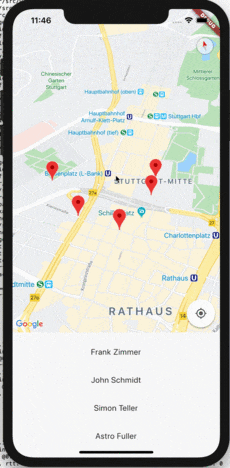
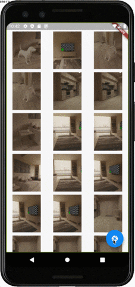
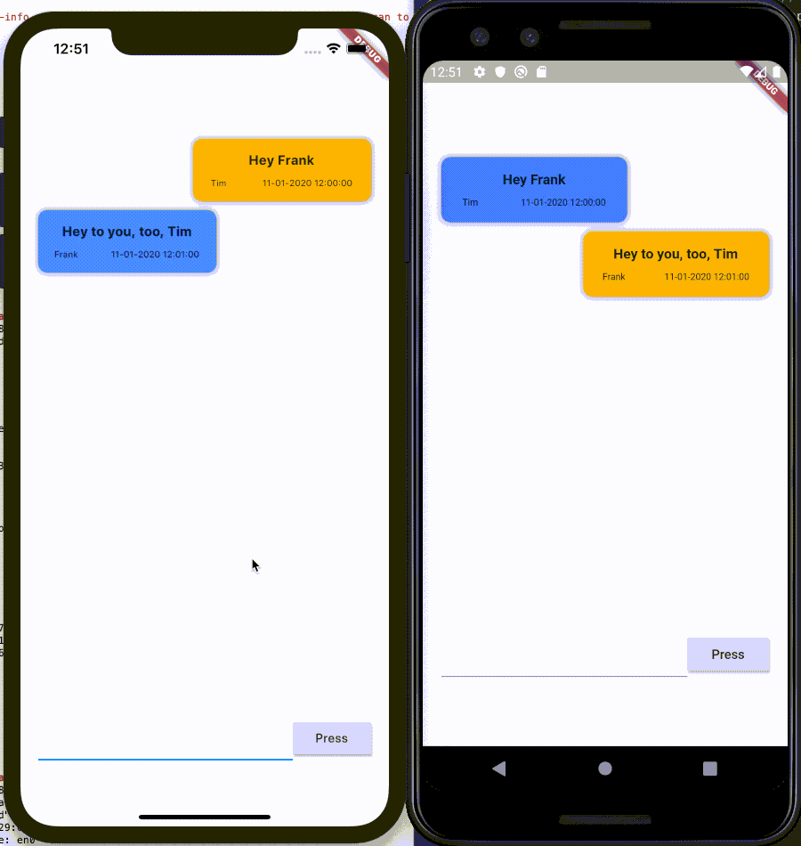
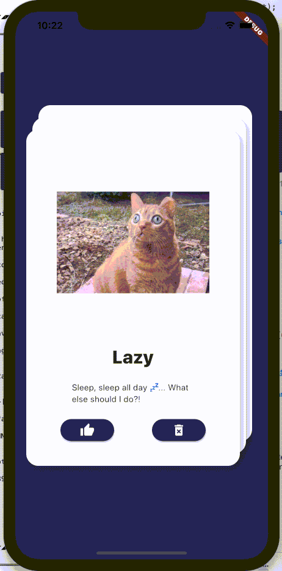
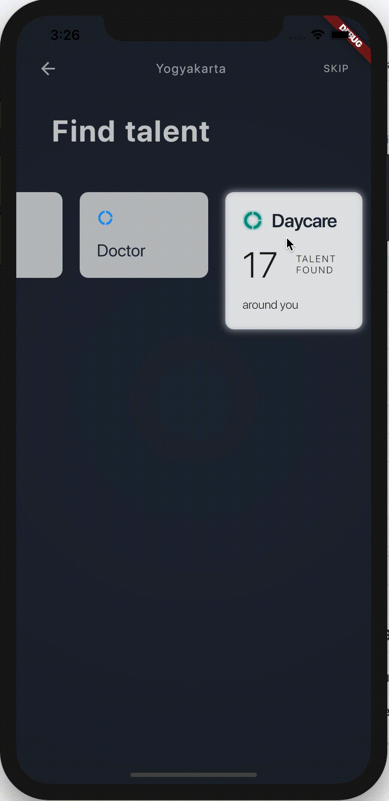
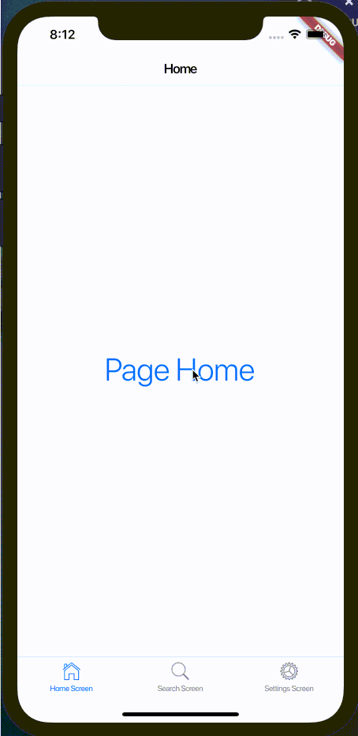
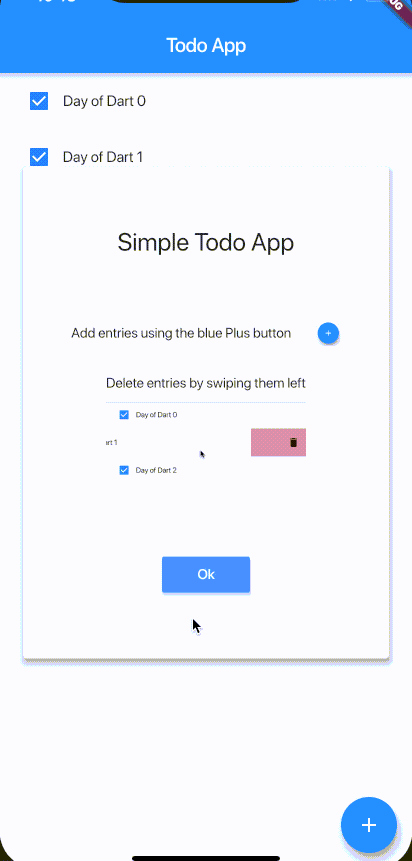

## Learning the Flutter way 
This repository documents my journey of learning Flutter to learn how to build the App I want to :smile:

Getting used to the Dart language by participating in the [AdventOfCode2019](https://github.com/timgrossmann/aoc-2019)

---

 

### Day 10 11 & 12 - Veggly App Redesign
The three days were used to redesign, and build the redesign of the Veggi dating app [Veggly](https://www.veggly.net).

- UI Design
- Project structure
- Image filter
- Decorations
- Gradients
- Lots of Stacks

 

### Day 9 - Geolocation and Maps
Trivial example on how to integrate google maps and geolocation into your app using the google maps dependency.

- Google Maps
- Markers
- Geolocation

 

### Day 8 - Camera and Gallery
Trivial example on how to use the camera to save an image, get the images on the device, display them and focus them on click.

- Navigator
- FutureBuilder
- Directory/Path
- GridView
- Camera

 

### Day 7 - Firebase Connect
Trivial firebase conncetion (read & write) chat app. Only two users, defined by the operating system Android or iOS.

- Firebase connection
- Text Input
- Android/iOS detection
- StreamBuilder

 

### Day 6 - Draggables
Learning about basic draggable widget.

- Draggables
- Positioning

 

### Day 5 - UI Concept
Learning Layout and Widgets by trying to build a Flutter UI based on [this design concept](https://dribbble.com/shots/3829227-Homecare-Concept-Exploration) of Zazuly Aziz.

- Advanced styling
- Decorations
- Alignments
- Project structure

 

### Day 4 - Cupertino specifics
Extremely Trivial trying out of iOS styled widgets and the difference in navigation structure (TabScaffold vs. PageScaffold).   

- Cupertino specific Elements, Button, ActionSheet, and Switch
- Navigation bar, Tab bar
- iOS specific navigation

 

### Day 3 - Simple Todo App
Pretty simple todo app with basic features like adding, checking, and deleting todos.   
Overlays for a simple "tutorial" and when a new item is added.

- Overlays using Cards
- Basic assets/image imports
- More state handling
- More user interaction

 

### Day 2 - Trivial List View
Very trivial list view to display a number of items with generated uuids.   
Interactions with the dismissable Widgets and handling immutable state changes.

- Dismissable Widgets
- List View / Builder
- Some more Layouting
- Inner Scaffolding for Snackbar display

 

### Day 1 - Trivial Quiz Game
Very trivial Quiz game with only few hard coded questions and score display.   
First usage of stateful widget.

- Statefull widget
- Interaction
- Basic File Structure
- Data from file

 

### Day0 - Basic Hello World
Extremely simple basic setup. Just a simple Hello World.

- General Project Setup
- Stateless widget
- Basic Layout

