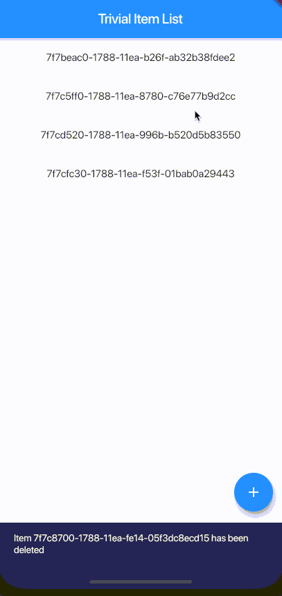
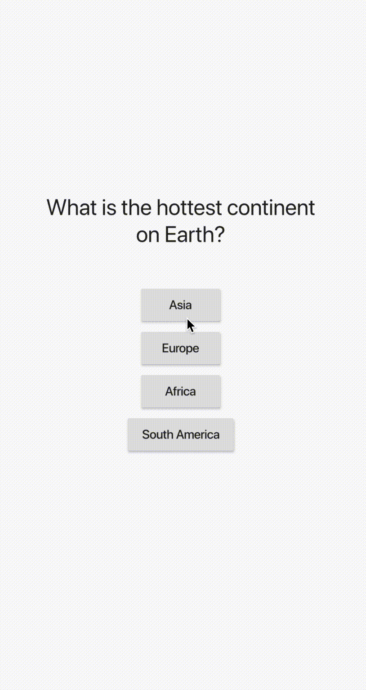
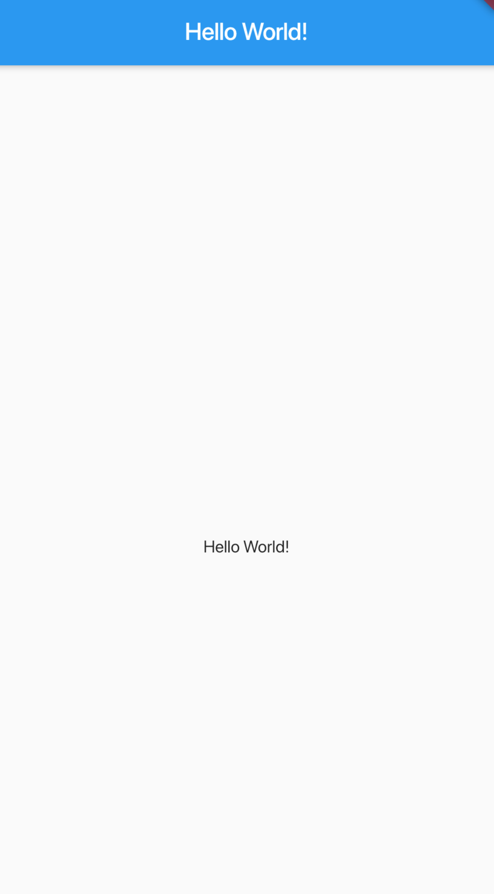

## Learning the Flutter way 
This repository documents my journey of learning Flutter to learn how to build the App I want to :smile:

Getting used to the Dart language by participating in the [AdventOfCode2019](https://github.com/timgrossmann/aoc-2019)

---

 

### Day2

- Dismissable Widgets
- List View / Builder
- Some more Layouting
- Inner Scaffolding for Snackbar display

 

### Day1

- Statefull widget
- Interaction
- Basic File Structure
- Data from file

 

### Day0
Extremely simple basic setup. Just a simple Hello World.

- General Project Setup
- Stateless widget
- Basic Layout

